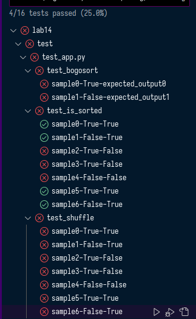
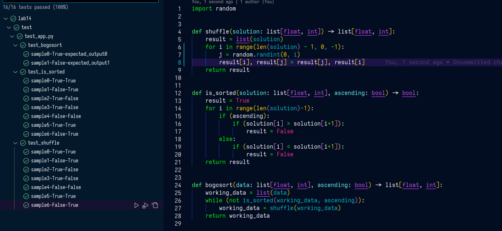
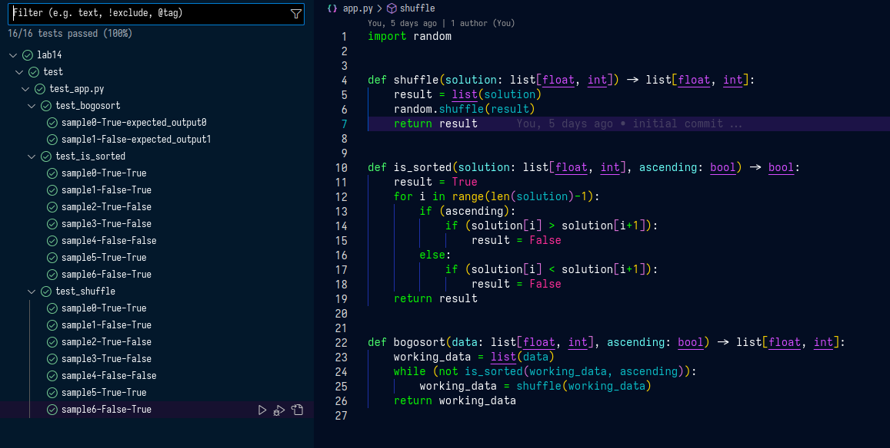

Pierwszym etapem było napisanie testów, zgodznie z założeniem nie przechodziły one bez napisania prawidłowego kodu.

W fazie green zaimplementowałem wszystkie funkcje, tak aby spełaniały one kryteria testów, lecz były one suboptymalne.

W fazie refactor zoptymalizowałem funkcję shuffle, tak aby używała ona optymalnej metody mieszania listy z bibloteki `random` pythona.

